<h3><code>yousuf@github ~ $ ./contributions.sh</code></h3>

  

<h3><code>yousuf@github ~ $ whoami</code></h3>

# Hi, I'm Yousuf

**I'm learning how systems break, and trying to understand why.**

I’m studying Cybersecurity at RIT with a minor in Finance, and lately I’ve become increasingly interested in the space where technology, data, and money meet.

Most of what I build starts with a question rather than a technology. Why did this transaction look different? What caused this behavior? Is there actually a pattern here, or am I just seeing noise? I like taking messy, unpredictable data and pulling it apart until something that initially looked complicated starts to make sense.

That has taken me through cybersecurity, network analysis, fraud detection, financial risk, machine learning, and data analytics. I learn best by building things, breaking them, staring at the results for longer than I probably should, and eventually figuring out what they were trying to tell me.

I also tend to wander into questions that have nothing to do with code. I spend a fair amount of time reading and writing about human behavior, morality, and the strange ways people make sense of their own actions. It turns out I have roughly the same curiosity about people that I have about systems: **what’s happening underneath the surface, and why?**

Most of the interesting things are hidden somewhere in that question.

Built with Python, SVG, GitHub Actions, and an unreasonable amount of curiosity.

